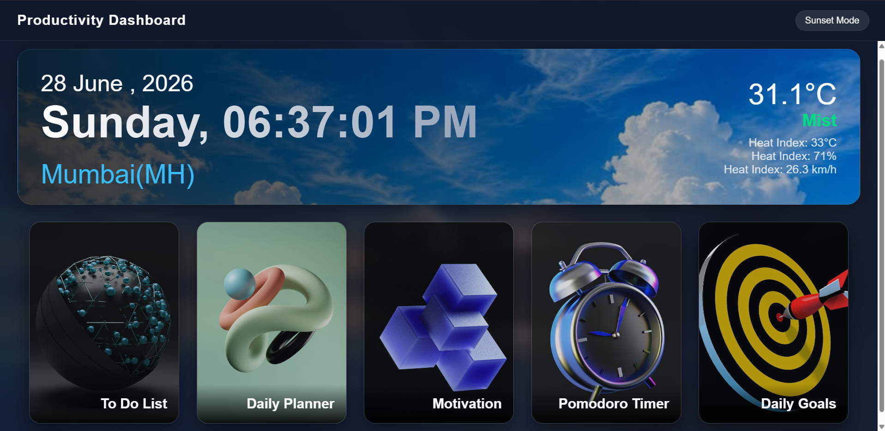
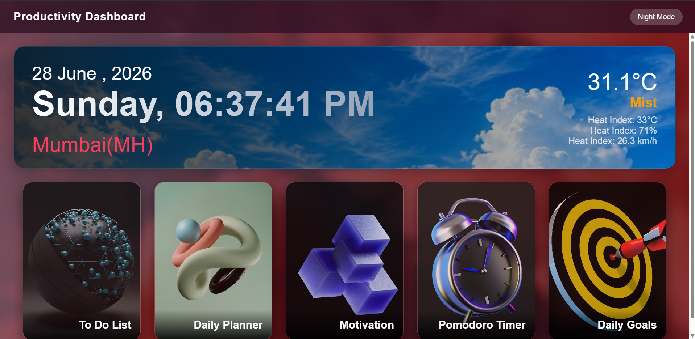
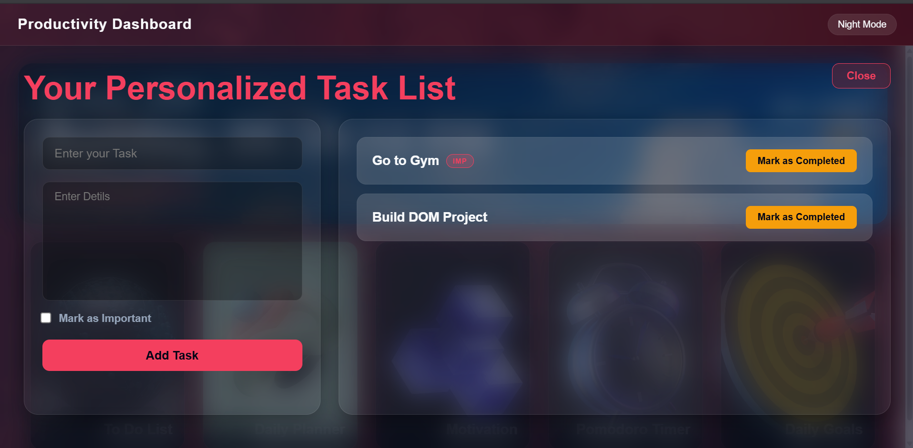
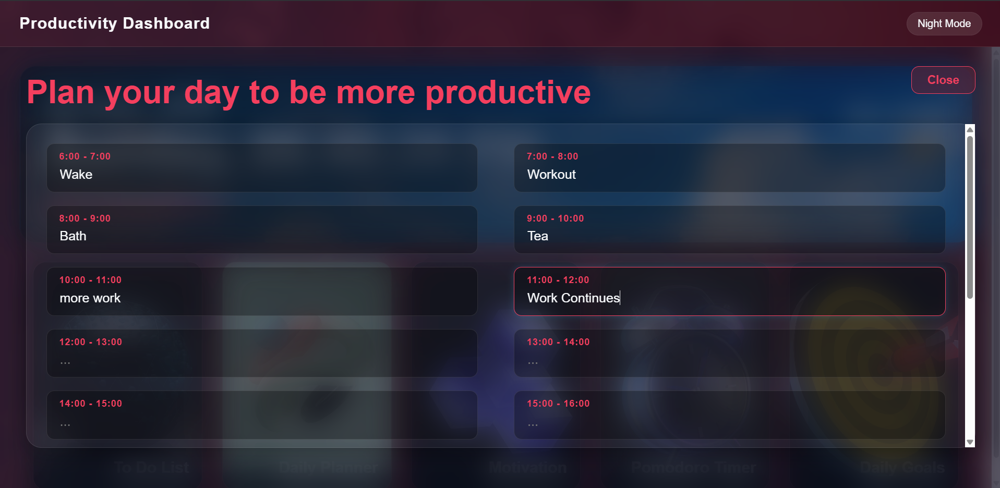
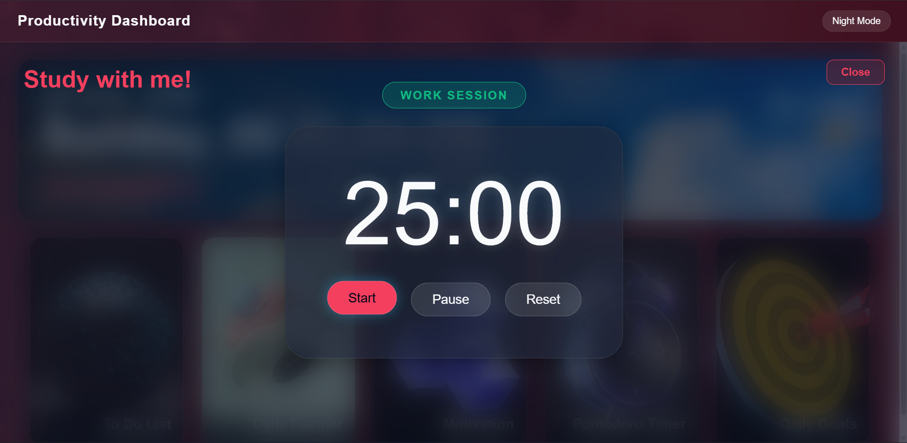
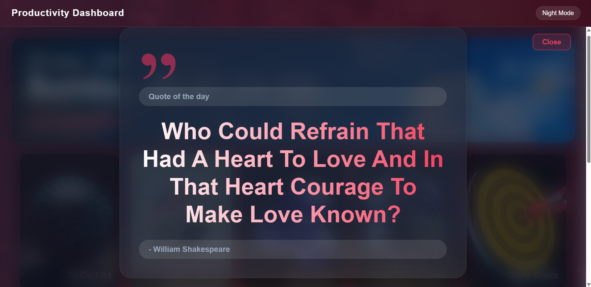

# 🚀 Productivity Dashboard

<p align="center">
  <strong>A modern productivity dashboard built with HTML, CSS, and Vanilla JavaScript.</strong>
</p>

<p align="center">
Organize your tasks, plan your day, stay motivated, and boost productivity—all from one beautiful dashboard.
</p>

---

## 📖 About The Project

The **Productivity Dashboard** is a lightweight frontend application designed to combine the most commonly used productivity tools into a single interface.

Instead of switching between multiple applications, users can manage their daily workflow from one dashboard.

The project is built entirely with **Vanilla JavaScript**, **HTML5**, and **CSS3**, without using any frontend frameworks or libraries. All user data is stored locally using the browser's **Local Storage API**, making the application fast, simple, and completely client-side.

---

## ✨ Features

### 📝 To-Do Manager

Manage daily tasks efficiently.

* Create unlimited tasks
* Add task descriptions
* Mark tasks as important
* Mark tasks as completed
* Delete tasks
* Automatic Local Storage support

---

### 📅 Daily Planner

Plan your schedule hour by hour.

* Schedule from **6:00 AM to 11:00 PM**
* Edit plans anytime
* Automatic saving
* Persistent schedule after refresh

---

### 🎯 Daily Goals

Build consistency by completing daily goals.

* Custom daily goals
* Daily challenge section
* XP reward system
* Completion progress tracking
* Daily achievement tracking
* Automatic daily reset

---

### 🍅 Pomodoro Timer

Improve focus using the Pomodoro Technique.

* 25-minute work sessions
* 5-minute break sessions
* Start / Pause / Reset
* Automatic work-break switching

---

### 💡 Motivation Quotes

Stay inspired throughout the day.

* Random motivational quotes
* Author information
* API integration

---

### 🌤 Weather Dashboard

View current weather information instantly.

* Temperature
* Weather condition
* Humidity
* Wind Speed
* Heat Index
* Live Clock
* Current Date

---

### 🎨 Theme Switcher

Customize your dashboard.

* Dark Theme
* Sunset Theme
* Theme preference stored automatically

---

## 📸 Screenshots

### 🏠 Landing Page



---

### 🌅 Sunset Theme



---

### 📝 To-Do Manager



---

### 📅 Daily Planner



---

### 🍅 Pomodoro Timer



---

### 💡 Motivation Page



---

## 🛠 Built With

* HTML5
* CSS3
* Vanilla JavaScript (ES6)
* Local Storage API
* WeatherAPI
* DummyJSON Quotes API

---

## 📂 Project Structure

```text
Productivity-Dashboard/
│
├── index.html
├── README.md
│
├── javascript/
│   └── script.js
│
├── style/
│   └── style_refreshed.css
│
├── fonts/
│   ├── AeonikTRIAL-Bold.otf
│   ├── AeonikTRIAL-Light.otf
│   └── AeonikTRIAL-Regular.otf
│
├── icons-images/
│   ├── android-chrome-192x192.png
│   └── icons8-get-quote-100.png
│
├── favicon_io/
│
└── screenshots/
    ├── Landing page.png
    ├── Landing page mode 2.png
    ├── Daily Planner.png
    ├── Motivation Page.png
    ├── Pomodoro Timer.png
    └── To-do-list.png
```

---

## 🚀 Getting Started

Clone the repository.

```bash
git clone https://github.com/your-username/productivity-dashboard.git
```

Navigate into the project.

```bash
cd productivity-dashboard
```

Open **index.html** in your preferred web browser.

No installation is required.

No dependencies are required.

No build tools are required.

---

## 💾 Local Storage

The dashboard automatically stores user data in the browser.

Saved information includes:

* To-Do Tasks
* Daily Planner
* Daily Goals
* XP Progress
* Achievements
* Theme Preference

---

## 📱 Responsive Design

The dashboard is optimized for:

* 💻 Desktop
* 🖥 Laptop
* 📱 Mobile Devices
* 📟 Tablets

---

## 🎯 Future Improvements

Planned features include:

* Circular progress indicator
* XP level system
* Achievement badges
* Daily streak tracking
* Weekly productivity heatmap
* Calendar integration
* Notifications & reminders
* Analytics dashboard
* Drag & Drop task management
* Data export/import
* Progressive Web App (PWA)
* Cloud synchronization

---

## 📚 What I Learned

This project helped strengthen my understanding of:

* DOM Manipulation
* Event Handling
* JavaScript Logic
* Fetch API
* Local Storage
* Responsive Design
* Glassmorphism UI
* CSS Animations
* Frontend Project Architecture
* API Integration

---

## 🤝 Contributing

Contributions are welcome.

1. Fork the repository
2. Create your feature branch

```bash
git checkout -b feature/new-feature
```

3. Commit your changes

```bash
git commit -m "Add new feature"
```

4. Push your branch

```bash
git push origin feature/new-feature
```

5. Open a Pull Request

---

## 📄 License

This project is licensed under the MIT License.

---

## 👨‍💻 Author

### Soham Kule

Information Technology Engineering Student

Passionate about:

* Web Development
* Artificial Intelligence
* UI/UX Design
* JavaScript Development
* Building Productivity Applications

---

## ⭐ Support

If you found this project helpful or interesting:

⭐ Star this repository

🍴 Fork the project

💬 Share your feedback

Every contribution and suggestion is appreciated.

---

<p align="center">
Made with ❤️ by Soham Kule
</p>
